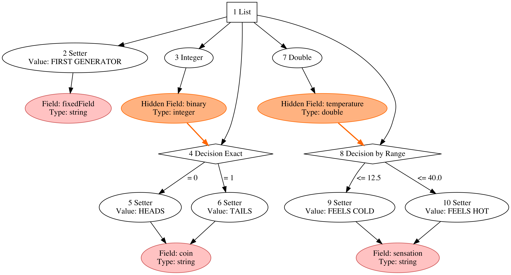

CSV Random Simulator
=========

The simulator creates CSV files with random records by defining its fields and random distributions on a [YAML] properties file.


Requirements
---

The JAR file execution only requires [Java 8] and the development requires [Maven] and optionally [Eclipse].
Additionally, the random variable dependencies visualization requires [GraphViz].

How to build it
---

Once the code was downloaded, inside the project directory run:

```sh
mvn compile
mvn assembly:assembly -DdescriptorId=jar-with-dependencies
mv target/csvSimulator-1.0-jar-with-dependencies.jar target/csvSimulator-1.0.jar
```

Aditionally, an eclipse project can be created by running:

```sh
mvn eclipse:eclipse
```

Simulator execution
---

The simulator needs a YAML configuration file that defines a CsvGenerator structure. For example, the next snippet shows the contents of *greetings.yml*:

```yaml
!!com.csvsim.wrapper.CsvGenerator
fields:
- &id001 {name: greeting, type: STRING}
generator: !!com.csvsim.wrapper.String {field: *id001, discreteHistogram: {Hi: 0.4, Bye: 0.4, Au revoir: 0.2}}
```

This files defines a single field named **greeting** and its discrete distribution with three strings: "Hi", "Bye", and "Au revoir".

To simulate an infinite number of records run:

```sh
java -jar target/csvSimulator-1.0.jar -f greetings.yml
```
To simulate only five records run:

```sh
java -jar target/csvSimulator-1.0.jar -f greetings.yml -n 5
```
Both simulations can be run on a socket server, for example, to simulate 100 records and start the server on port 2020 type:

```sh
java -jar target/csvSimulator-1.0.jar -f greetings.yml -n 100 -p 2020
```
To test the server, open another terminal and run telnet on port 2020:

```sh
telnet localhost 2020
```
Finally, to create a field and random distribution dependency graph in [DOT] language run:

```sh
java -jar target/csvSimulator-1.0.jar -f greetings.yml -d greetings.dot
```
To create a SVG file run:

```sh
dot -Tsvg greetings.dot > greetings.svg
```

For instance, the next image shows the fields and random distributions of the **3.containers.yml** example.




Examples
---

The next example files are located in the main directory:

- 0.helloWorld.yml
- 1.fieldStructure.yml
- 2.basicGenerators.yml
- 3.containers.yml
- 4.discreteEventDispatcher.yml


[Java 8]: http://www.oracle.com/technetwork/java/javase/downloads/jdk8-downloads-2133151.html
[Eclipse]: https://www.eclipse.org/home/index.php
[GraphViz]: http://www.graphviz.org/
[Maven]: http://maven.apache.org/
[YAML]:http://www.yaml.org/
[Homebrew]: http://brew.sh/
[MacPorts]:https://www.macports.org/ports.php
[DOT]:http://en.wikipedia.org/wiki/DOT_(graph_description_language)
